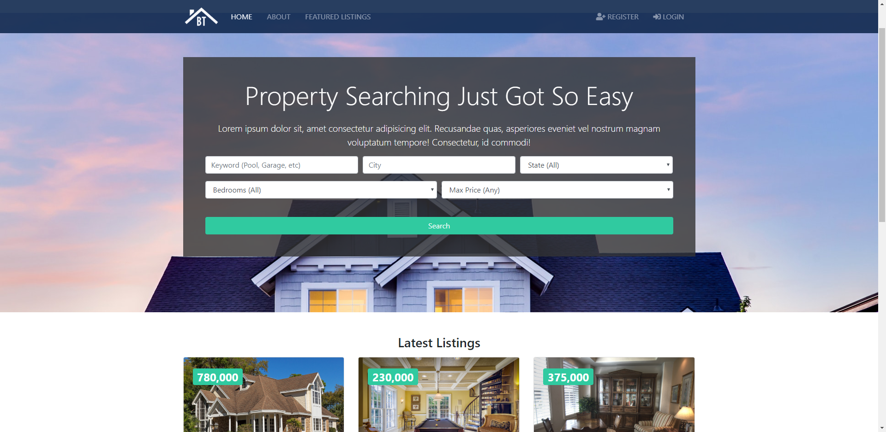
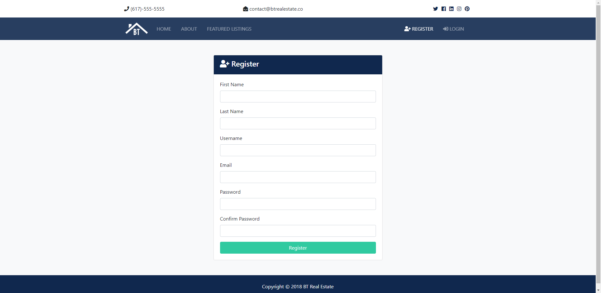
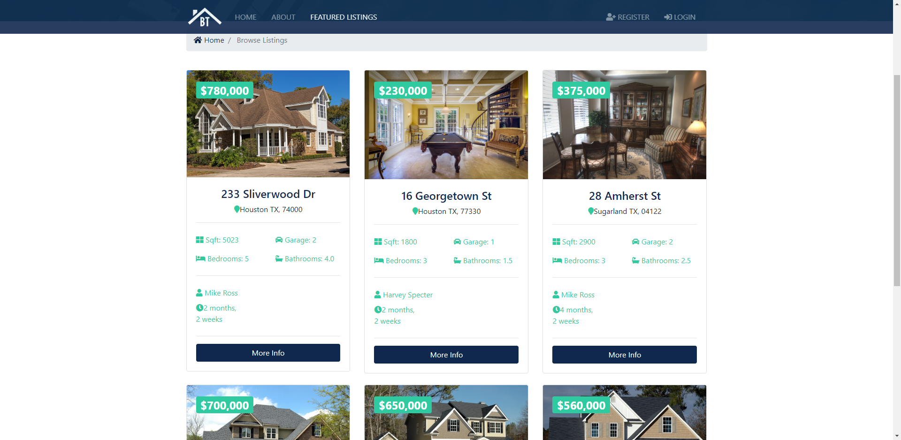
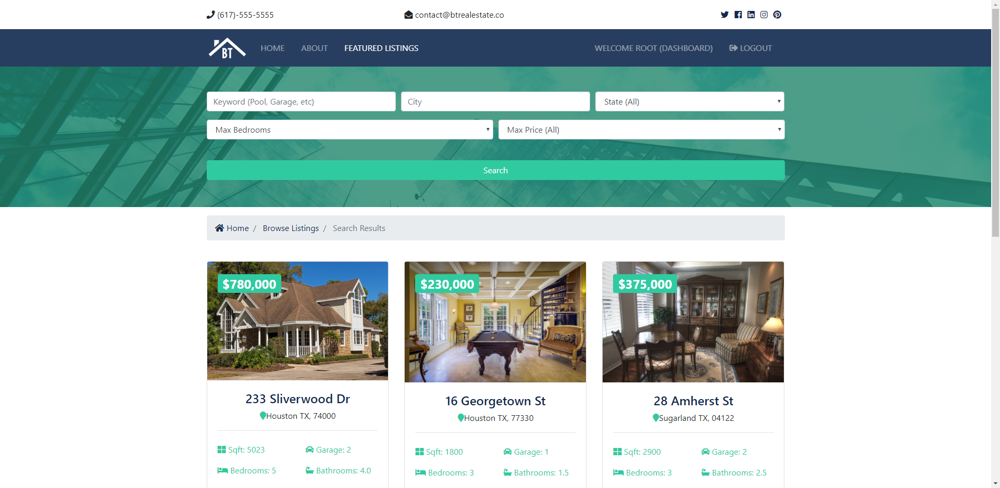
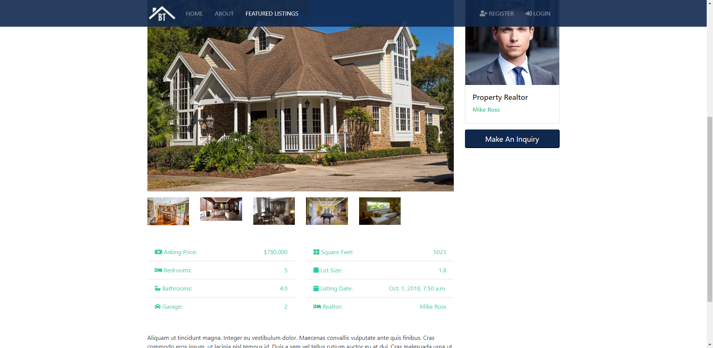
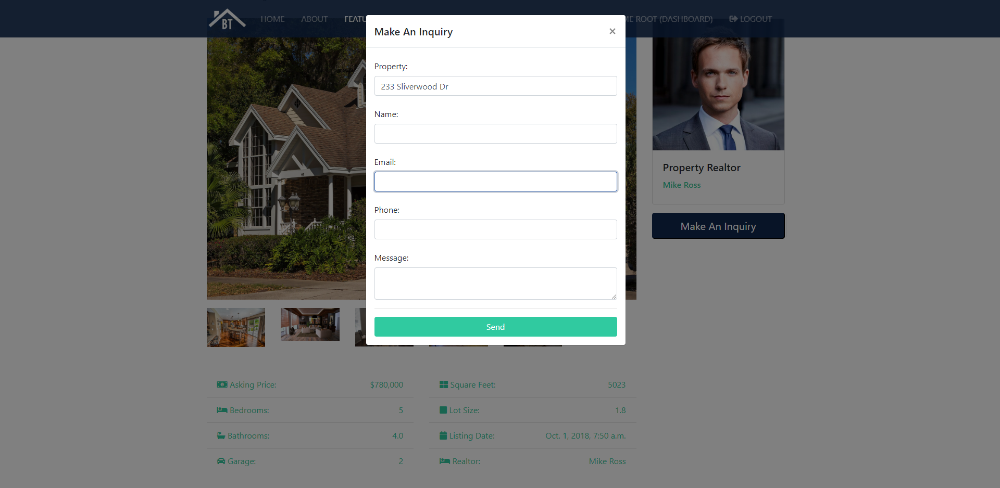

# Real Estate Web
**Build a real estate trading platform allowing customers to post house listings, communicate with realtors and search for
property**

##Implementation
Develop this web application with Django and Bootstrap.

Manage data using PostgreSQL.

Deploy on Ubuntu server using Gunicorn and Ngnix.

##Preview
**Main page**

**Registration and Login**

**House Listings**

**Search**

**Property details and contacts with realtors**

